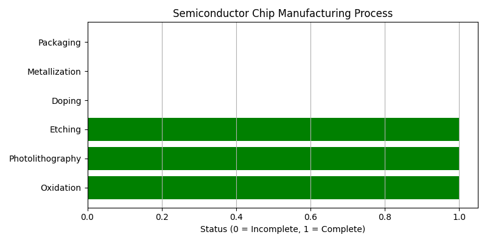

#  Semiconductor Chip Manufacturing Process Simulator

This Python project simulates the fabrication steps of an integrated circuit chip, including oxidation, photolithography, etching, doping, and more. It is intended as an educational tool to better understand the end-to-end manufacturing process of semiconductor devices.

#  Semiconductor Chip Manufacturing Process Simulator

This Python project simulates the fabrication steps of an integrated circuit chip...

#  Semiconductor Chip Manufacturing Process Simulator

This Python project simulates the fabrication steps of an integrated circuit chip...




##  Features

- Simulates real-world semiconductor manufacturing steps
- Tracks progress and logic flow
- Visualizes status with a bar chart (using matplotlib)
- Interactive command-line interface

##  Requirements

Install dependencies:

```bash
pip install -r requirements.txt

##  Academic Context
This project was developed as part of the Semiconductor Technology course taught by
Prof. Dr.-Ing. Gerhard Kahmen, Wissenschaftlich-Technischer Geschäftsführer.


[def]: Semiconductor_Chip_Manufacturing_Process.png
